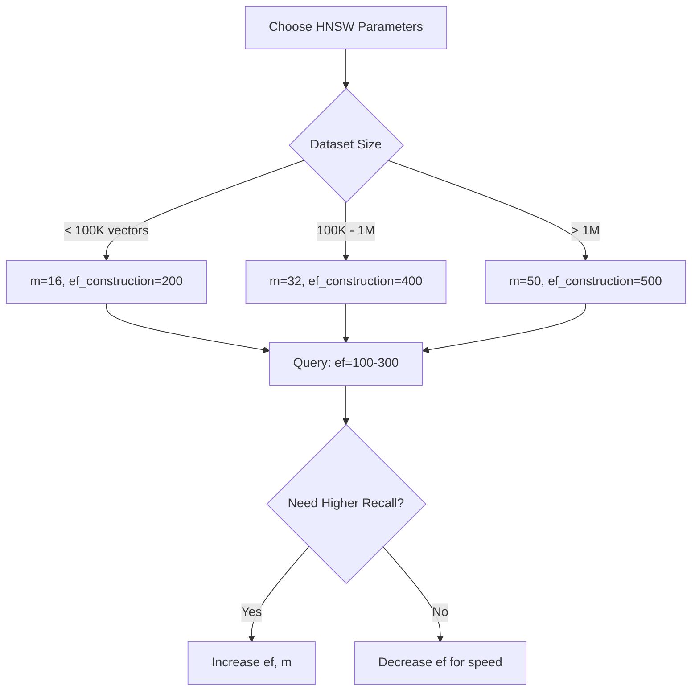
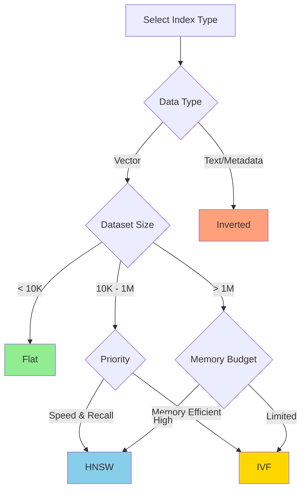

Zvec supports multiple index types, each optimized for different use cases. Understanding the trade-offs between accuracy, speed, and memory usage is crucial for optimal performance.

## Overview

Zvec provides four primary index types for vector search:

| Index Type | Use Case | Search Speed | Memory | Accuracy | Training Required |
|------------|----------|--------------|--------|----------|-------------------|
| **HNSW** | High-performance ANN | Very Fast | High | High (>95%) | No |
| **IVF** | Large-scale datasets | Fast | Medium | Medium-High | Yes |
| **Flat** | Small datasets, exact search | Medium | Low | 100% (exact) | No |
| **Inverted** | Text/keyword search | Very Fast | Low | 100% (exact) | No |

## HNSW (Hierarchical Navigable Small World)

### Overview

HNSW is a graph-based approximate nearest neighbor (ANN) index that provides excellent recall with fast search times. It constructs a multi-layer graph structure where each node represents a vector.

### Configuration

```python
from zvec import HnswIndexParam
from zvec.typing import MetricType, QuantizeType

# Basic configuration
params = HnswIndexParam(
    metric_type=MetricType.COSINE,
    m=50,                      # Links per node
    ef_construction=500,       # Build-time candidate list
    quantize_type=QuantizeType.UNDEFINED  # No quantization
)
```

### Parameters

#### `metric_type` (MetricType)

Distance metric for similarity computation:

- `MetricType.IP` - Inner product (dot product)
- `MetricType.L2` - Euclidean distance
- `MetricType.COSINE` - Cosine similarity

**Default:** `MetricType.IP`

#### `m` (int)

Number of bi-directional links created for each element during construction.

- **Range:** Typically 8-64
- **Higher values:**
  - Better recall (accuracy)
  - Increased memory usage (~4 * m * 4 bytes per vector)
  - Slower construction
- **Lower values:**
  - Faster construction
  - Lower memory footprint
  - May reduce recall

**Default:** `50`  
**Recommended:** 16-32 for most applications

#### `ef_construction` (int)

Size of the dynamic candidate list during index construction.

- **Range:** Typically 100-2000
- **Higher values:**
  - Better graph quality
  - Higher recall
  - Slower build time
- **Lower values:**
  - Faster construction
  - May impact recall

**Default:** `500`  
**Recommended:** At least 2 * m, often 200-500

#### `quantize_type` (QuantizeType)

Vector compression method. See [Quantization](/advanced/quantization) for details.

**Default:** `QuantizeType.UNDEFINED` (no quantization)

### Query-Time Parameters

Control search behavior with `HnswQueryParam`:

```python
from zvec import HnswQueryParam

query_params = HnswQueryParam(
    ef=300,              # Search-time candidate list
    radius=0.0,          # Range query threshold
    is_linear=False,     # Force brute-force search
    is_using_refiner=False  # Use refiner for improved accuracy
)
```

#### `ef` (int)

Size of the dynamic candidate list during search.

- **Range:** Typically topk to 1000+
- **Higher values:** Better recall, slower search
- **Lower values:** Faster search, lower recall

**Default:** `300`  
**Recommendation:** Set `ef >= topk` for good results

### Performance Tuning



### Best Practices

1. **Balance m and ef_construction**: Higher `m` requires higher `ef_construction` for optimal graph quality
2. **Query ef tuning**: Start with `ef = 2 * topk`, adjust based on recall requirements
3. **Memory consideration**: HNSW uses ~(4 + 4 * m) bytes per vector for graph structure
4. **No training required**: Can insert vectors incrementally

---

## IVF (Inverted File Index)

### Overview

IVF partitions the vector space into clusters using k-means. At query time, only the nearest clusters are searched, providing a speed-accuracy trade-off.

### Configuration

```python
from zvec import IVFIndexParam
from zvec.typing import MetricType, QuantizeType

params = IVFIndexParam(
    metric_type=MetricType.L2,
    n_list=0,              # Auto-detect number of clusters
    n_iters=10,            # K-means iterations
    use_soar=False,        # SOAR optimization
    quantize_type=QuantizeType.UNDEFINED
)
```

### Parameters

#### `metric_type` (MetricType)

Same as HNSW. See above.

#### `n_list` (int)

Number of clusters (inverted lists) to partition the dataset into.

- **Auto mode (`n_list=0`)**: System selects based on data size
  - Typical formula: `sqrt(N)` where N is dataset size
- **Manual mode**: Set explicitly
  - **Range:** 10 to 100,000+
  - **More clusters:** Better accuracy, slower search
  - **Fewer clusters:** Faster search, lower accuracy

**Default:** `0` (auto)  
**Recommended:** `sqrt(N)` for balanced performance

#### `n_iters` (int)

Number of iterations for k-means clustering during training.

- **Range:** 5-50
- **Higher values:** More stable centroids, longer training
- **Lower values:** Faster training, less stable clusters

**Default:** `10`

#### `use_soar` (bool)

Enable SOAR (Scalable Optimized Adaptive Routing) for improved IVF search.

**Default:** `False`  
**Recommendation:** Enable for large-scale datasets (>1M vectors)

### Query-Time Parameters

```python
from zvec import IVFQueryParam

query_params = IVFQueryParam(
    nprobe=10  # Number of clusters to search
)
```

#### `nprobe` (int)

Number of nearest clusters to probe during search.

- **Range:** 1 to `n_list`
- **Higher values:** Better recall, slower search
- **Lower values:** Faster search, lower recall

**Default:** `10`  
**Recommendation:** 5-20% of `n_list` for good recall

### Training Requirement

IVF requires training on representative data before use:

```python
import zvec

# Create collection with IVF index
schema = zvec.CollectionSchema(
    name="ivf_example",
    vectors=zvec.VectorSchema(
        "embedding",
        zvec.DataType.VECTOR_FP32,
        dimension=128,
        index_param=IVFIndexParam(n_list=100)
    )
)

collection = zvec.create_and_open("./ivf_data", schema)

# Insert training data (triggers k-means clustering)
collection.insert([...])  # At least 1000+ vectors recommended
```

### Performance Tuning

| Dataset Size | n_list | nprobe | Expected Recall |
|--------------|--------|--------|----------------|
| 10K | 100 | 10 | ~90% |
| 100K | 300 | 20 | ~92% |
| 1M | 1000 | 30 | ~93% |
| 10M | 4000 | 50 | ~94% |

### Best Practices

1. **Training data**: Use at least 1000-10000 representative vectors for training
2. **nprobe tuning**: Start with `nprobe = sqrt(n_list)`, adjust based on recall needs
3. **SOAR optimization**: Enable for datasets >1M vectors
4. **Memory efficient**: Lower memory footprint than HNSW for large datasets

---

## Flat (Brute-Force)

### Overview

Flat index performs exact nearest neighbor search by comparing the query vector against all vectors. It's simple, accurate, and ideal for small datasets or baseline comparisons.

### Configuration

```python
from zvec import FlatIndexParam
from zvec.typing import MetricType, QuantizeType

params = FlatIndexParam(
    metric_type=MetricType.L2,
    quantize_type=QuantizeType.UNDEFINED
)
```

### Parameters

#### `metric_type` (MetricType)

Same as HNSW and IVF.

#### `quantize_type` (QuantizeType)

Optional quantization for memory reduction. See [Quantization](/advanced/quantization).

### When to Use Flat

- **Small datasets** (under 10,000 vectors)
- **Exact search required** (100% recall)
- **Baseline for benchmarking** other index types
- **Development and testing**

### Performance Characteristics

```python
# Example: 10,000 vectors, 768 dimensions
# Search time: ~1-5ms (exact, linear scan)
# Memory: Minimal (just vector storage)
# Recall: 100% (exact)
```

### Best Practices

1. **Use for under 10K vectors**: Beyond this, consider HNSW or IVF
2. **Quantization**: Apply FP16 or INT8 to reduce memory without indexing overhead
3. **Baseline testing**: Always compare ANN indexes against Flat for recall validation

---

## Inverted (Text/Keyword Index)

### Overview

Inverted index is designed for keyword and text search, not vector similarity. It supports efficient filtering and text queries.

### Configuration

```python
from zvec import InvertIndexParam

params = InvertIndexParam(
    enable_range_optimization=True,   # Optimize range queries
    enable_extended_wildcard=False    # Enable suffix/infix search
)
```

### Parameters

#### `enable_range_optimization` (bool)

Enable optimization for range queries (e.g., `age > 25 AND age < 50`).

**Default:** `False`

#### `enable_extended_wildcard` (bool)

Enable extended wildcard search including suffix and infix patterns.

- `False`: Only prefix search (e.g., `"app*"`)
- `True`: Suffix and infix search (e.g., `"*ple"`, `"*pp*"`)

**Default:** `False`  
**Note:** Extended wildcards increase index size

### Use Cases

- **Hybrid search**: Combine with vector indexes for filtered retrieval
- **Metadata filtering**: Efficient WHERE clause execution
- **Text search**: Keyword and phrase matching

### Example

```python
import zvec
from zvec.typing import DataType

schema = zvec.CollectionSchema(
    name="hybrid_example",
    vectors=zvec.VectorSchema("embedding", DataType.VECTOR_FP32, 768),
    fields=[
        zvec.FieldSchema(
            "category",
            DataType.STRING,
            index_param=InvertIndexParam(enable_range_optimization=True)
        )
    ]
)

collection = zvec.create_and_open("./hybrid_data", schema)

# Query with filter
results = collection.query(
    zvec.VectorQuery("embedding", vector=[...]),
    filter="category = 'electronics'",
    topk=10
)
```

---

## Index Selection Guide



## Comparison Table

| Feature | HNSW | IVF | Flat | Inverted |
|---------|------|-----|------|----------|
| **Search Type** | ANN | ANN | Exact | Exact (text) |
| **Recall** | 95-99% | 90-95% | 100% | 100% |
| **QPS (1M vectors)** | 10K-50K | 5K-20K | 100-500 | 50K+ |
| **Memory** | High | Medium | Low | Low |
| **Build Time** | Fast | Medium | Instant | Fast |
| **Training** | No | Yes | No | No |
| **Incremental Insert** | Yes | Limited | Yes | Yes |
| **Best For** | Production | Large-scale | Small data | Filtering |

## See Also

- [Quantization](/advanced/quantization) - Reduce memory usage
- [Performance Tuning](/guides/performance-tuning) - Optimization strategies
- [API Reference](/api/index/hnsw) - Complete parameter documentation