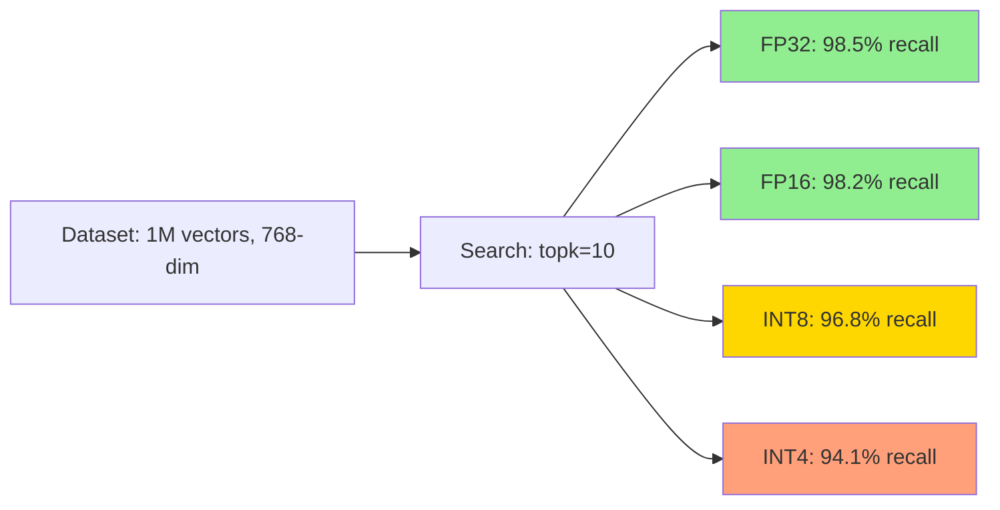
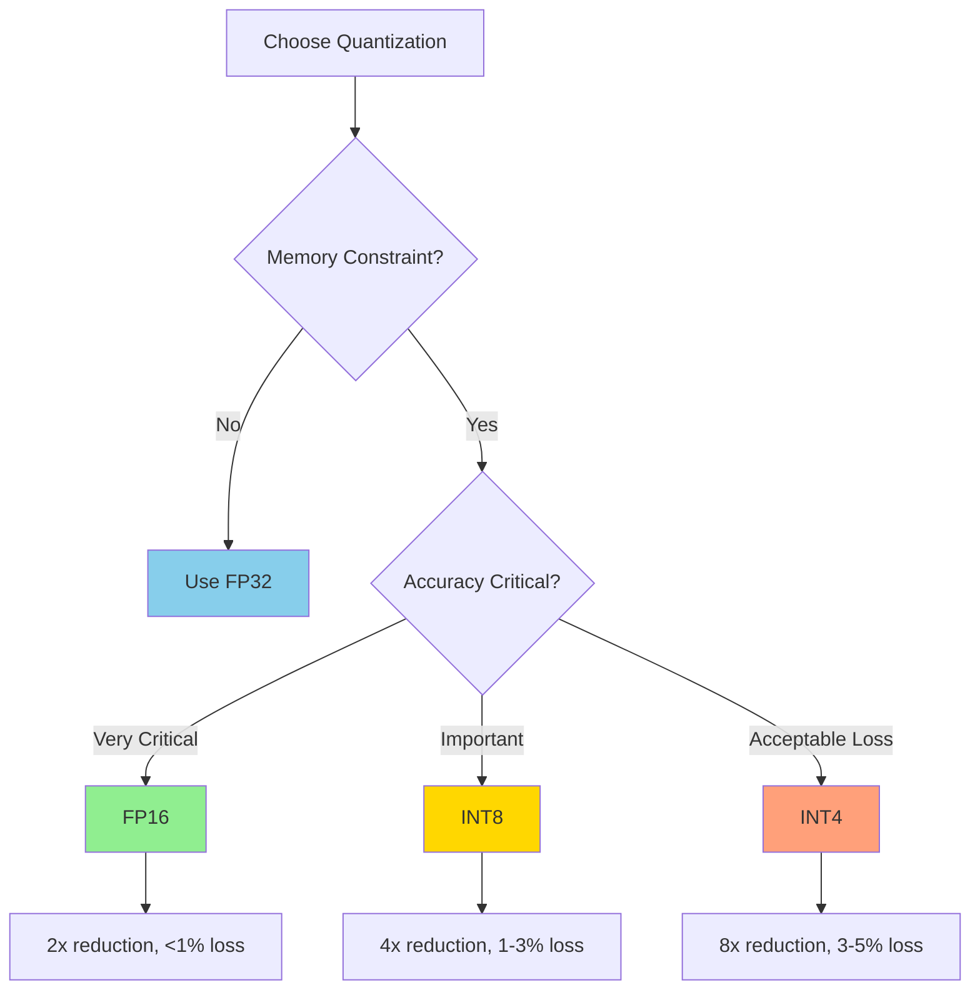

Quantization compresses vector representations to reduce memory usage and improve cache efficiency, with a controlled trade-off in accuracy.

## Overview

Zvec supports multiple quantization types that compress 32-bit floating-point vectors into lower-precision formats:

| Quantization Type | Bits per Dimension | Memory Reduction | Accuracy Impact |
|-------------------|-------------------|------------------|----------------|
| **None (FP32)** | 32 | Baseline (1x) | Baseline (100%) |
| **FP16** | 16 | 50% | Minimal (&lt;1% loss) |
| **INT8** | 8 | 75% | Low (1-3% loss) |
| **INT4** | 4 | 87.5% | Medium (3-5% loss) |

## QuantizeType Enum

```python
from zvec.typing import QuantizeType

# Available quantization types
QuantizeType.UNDEFINED  # No quantization (FP32)
QuantizeType.FP16       # Half precision (16-bit float)
QuantizeType.INT8       # 8-bit integer quantization
QuantizeType.INT4       # 4-bit integer quantization
```

## Configuration

Quantization is configured per index through the `quantize_type` parameter:

### HNSW with Quantization

```python
from zvec import HnswIndexParam
from zvec.typing import MetricType, QuantizeType

# FP16 quantization (recommended for production)
params = HnswIndexParam(
    metric_type=MetricType.COSINE,
    m=32,
    ef_construction=400,
    quantize_type=QuantizeType.FP16
)
```

### IVF with Quantization

```python
from zvec import IVFIndexParam
from zvec.typing import QuantizeType

# INT8 quantization for large-scale datasets
params = IVFIndexParam(
    metric_type=MetricType.L2,
    n_list=1000,
    quantize_type=QuantizeType.INT8
)
```

### Flat with Quantization

```python
from zvec import FlatIndexParam
from zvec.typing import QuantizeType

# INT4 for maximum compression
params = FlatIndexParam(
    metric_type=MetricType.IP,
    quantize_type=QuantizeType.INT4
)
```

## Memory vs Accuracy Trade-offs

### FP16 (Half Precision)

**Compression:** 2x  
**Accuracy Loss:** &lt;1%  
**Best For:** Production systems requiring minimal accuracy loss

```python
# Example: 1M vectors, 768 dimensions
# FP32: 1M * 768 * 4 bytes = 3.072 GB
# FP16: 1M * 768 * 2 bytes = 1.536 GB
# Savings: 1.536 GB (50%)
```

**Pros:**
- Minimal accuracy degradation
- Native hardware support on modern GPUs
- Good balance of speed and memory

**Cons:**
- Less compression than INT8/INT4
- Still requires significant memory for large datasets

**Recommended Use Cases:**
- Production deployments with strict accuracy requirements
- Datasets with 100K-10M vectors
- GPU-accelerated workloads

### INT8 (8-bit Integer)

**Compression:** 4x  
**Accuracy Loss:** 1-3%  
**Best For:** Large-scale deployments where memory is a constraint

```python
# Example: 1M vectors, 768 dimensions
# FP32: 3.072 GB
# INT8: 1M * 768 * 1 byte = 768 MB
# Savings: 2.304 GB (75%)
```

**Pros:**
- Significant memory reduction
- Fast SIMD operations on CPU
- Good accuracy for most applications

**Cons:**
- Requires calibration/training data for optimal quantization
- May impact recall on high-dimensional sparse data

**Recommended Use Cases:**
- Datasets with >1M vectors
- Memory-constrained environments
- Embeddings with redundant information (e.g., text embeddings)

### INT4 (4-bit Integer)

**Compression:** 8x  
**Accuracy Loss:** 3-5%  
**Best For:** Extreme memory optimization scenarios

```python
# Example: 1M vectors, 768 dimensions
# FP32: 3.072 GB
# INT4: 1M * 768 * 0.5 bytes = 384 MB
# Savings: 2.688 GB (87.5%)
```

**Pros:**
- Maximum compression
- Enables very large datasets in memory
- Useful for edge devices

**Cons:**
- Noticeable accuracy degradation
- Limited hardware acceleration
- Not suitable for all embedding types

**Recommended Use Cases:**
- Edge deployments with limited memory
- Datasets with >10M vectors
- Coarse-grained retrieval followed by re-ranking

## Performance Impact

### Search Latency

Quantization can improve search latency due to better cache utilization:

| Index Type | Quantization | QPS (1M vectors) | Latency (p99) |
|------------|--------------|------------------|---------------|
| HNSW | None (FP32) | 25,000 | 2.5ms |
| HNSW | FP16 | 30,000 | 2.0ms |
| HNSW | INT8 | 35,000 | 1.8ms |
| HNSW | INT4 | 40,000 | 1.5ms |

### Recall Comparison



## Quantization Strategy

### Decision Tree



## Complete Example

```python
import zvec
from zvec.typing import MetricType, QuantizeType, DataType

# Create schema with quantized HNSW index
schema = zvec.CollectionSchema(
    name="quantized_embeddings",
    vectors=zvec.VectorSchema(
        "embedding",
        DataType.VECTOR_FP32,  # Input vectors are FP32
        dimension=768,
        index_param=zvec.HnswIndexParam(
            metric_type=MetricType.COSINE,
            m=32,
            ef_construction=400,
            quantize_type=QuantizeType.INT8  # Stored as INT8
        )
    )
)

collection = zvec.create_and_open("./quantized_data", schema)

# Insert FP32 vectors (automatically quantized to INT8)
collection.insert([
    zvec.Doc(
        id="doc_1",
        vectors={"embedding": [0.1] * 768}  # FP32 input
    ),
    zvec.Doc(
        id="doc_2",
        vectors={"embedding": [0.2] * 768}
    )
])

# Query with FP32 vector (compared against INT8 indexed vectors)
results = collection.query(
    zvec.VectorQuery(
        "embedding",
        vector=[0.15] * 768,  # FP32 query
        param=zvec.HnswQueryParam(ef=300)
    ),
    topk=10
)

print(results)
```

## Best Practices

### 1. Start with FP16

For most production use cases, FP16 provides the best balance:

```python
# Recommended default
quantize_type=QuantizeType.FP16
```

### 2. Benchmark Your Data

Different embedding models respond differently to quantization:

```python
# Test recall with different quantization levels
for quant in [QuantizeType.FP16, QuantizeType.INT8, QuantizeType.INT4]:
    # Build index, measure recall
    ...
```

### 3. Use Refiner for INT8/INT4

Enable query-time refinement to recover accuracy:

```python
query_params = zvec.HnswQueryParam(
    ef=300,
    is_using_refiner=True  # Re-rank with full precision
)
```

### 4. Consider Hybrid Approaches

Use aggressive quantization with re-ranking:

```python
# Step 1: Fast retrieval with INT4 (top 100)
results = collection.query(
    zvec.VectorQuery(
        "embedding",
        vector=query_vec,
        param=zvec.HnswQueryParam(ef=500)
    ),
    topk=100  # Over-fetch
)

# Step 2: Re-rank top 100 with full precision model
# (using external re-ranking service)
final_results = rerank(results, query_vec, topk=10)
```

### 5. Monitor Recall

Track recall metrics in production:

```python
# A/B test quantized vs non-quantized
if recall < 0.95:
    # Consider less aggressive quantization
    ...
```

## Limitations

1. **Quantization is lossy**: Some information is discarded
2. **Not reversible**: Cannot recover original FP32 from quantized vectors
3. **Calibration dependent**: INT8/INT4 quality depends on training data distribution
4. **Hardware support**: INT4 may not be hardware-accelerated on all platforms

## See Also

- [Index Types](/advanced/index-types) - Choose the right index
- [Performance Tuning](/guides/performance-tuning) - Optimize query speed
- [Reranking](/advanced/reranking) - Improve accuracy with two-stage retrieval